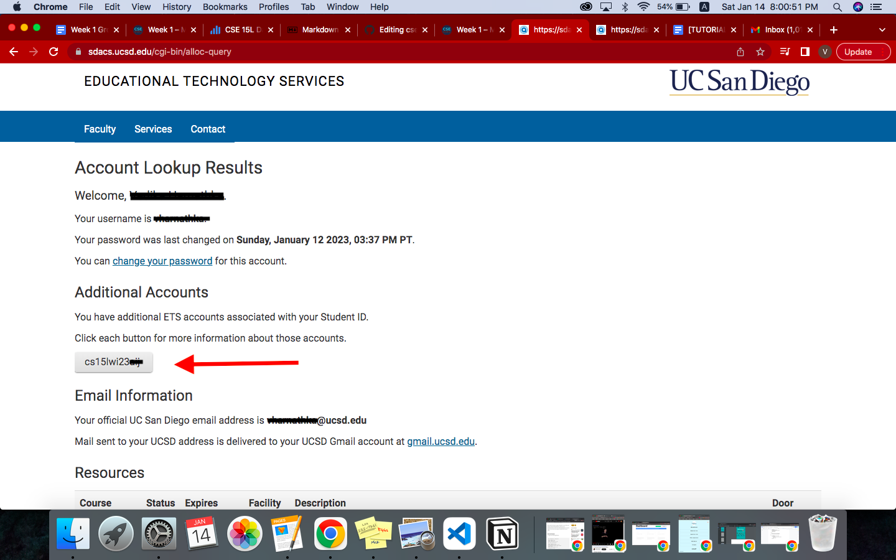
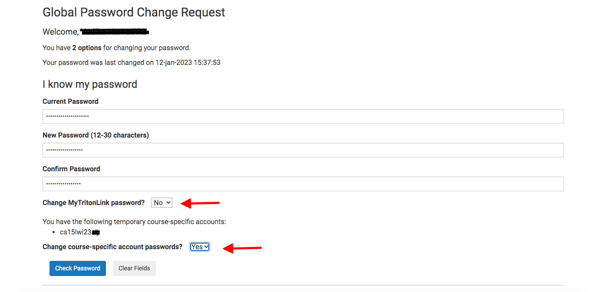
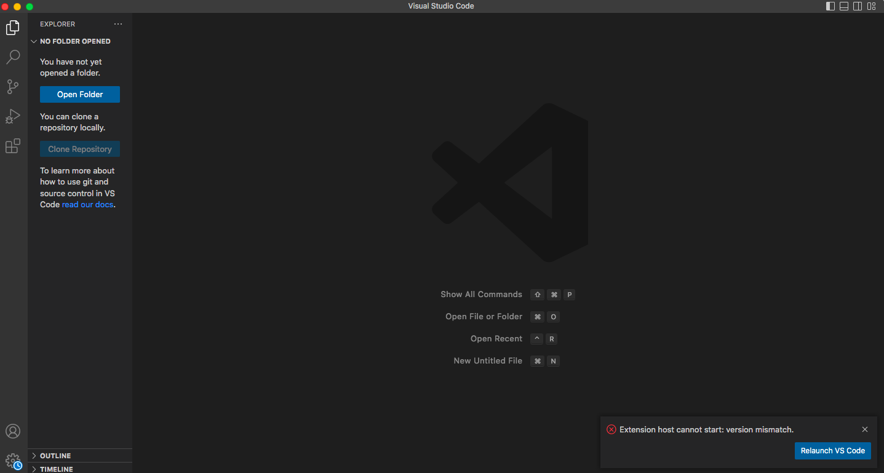
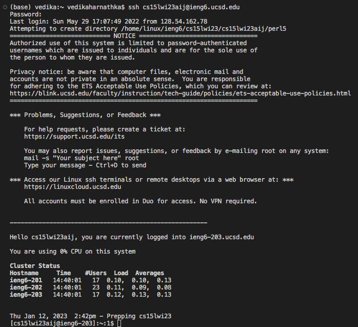
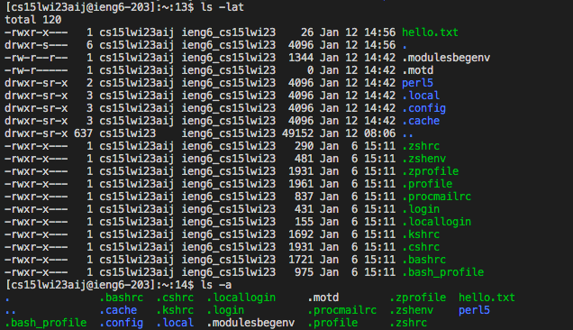

# Lab Report 1

**This is a tutorial to show you how to successfully connect to and run commands on a remote computer in UCSD's CSE basement.**

## Step 1: Logging into your CSE15L Account
Click [here](https://sdacs.ucsd.edu/~icc/index.php) for your course-specific CSE 15L account.

Log in with your username and your student ID (it should start with either an A or a U). 
Click on the CSE 15L account name. it should be in a grey box. 



Click on the change password link.

---
### Changing your password
Enter the password you use for your UCSD account, and follow the requirements for your new password.

The next part is a little complicated:



Make sure to click ***No*** for change MyTritonLink password and ***Yes*** for change course-specific account password. Now **don't** click on check password. Instead, after you have selected Yes for change course-specific account password, hit enter on your keyboard. 

---

Once you have successfully reset your password, wait for at least 15 minutes before doing step 3.

## Step 2: Installing VS Code
In the meantime, let’s install Visual Studio Code.

Go to the Visual Studio Code website [here](https://code.visualstudio.com/), and follow the instructions specific to your device’s operating system to download and install the application.

Here is what it should look like once you’ve successfully installed and opened the app:



## Step 3: Remotely Connecting
If it has been 15 minutes since you changed your password, you can connect to a remote computer. **Note: These instructions are specific to macOS users.**

On VScode, open a terminal, using Command+`. Type in your first command:

```
ssh cs15lwi23xx@ieng6.ucsd.edu
```

Where xx is the code for your specific account. `ssh` is also known as secure shell, it is the main command to access a computer remotely.

Your first message should ask to confirm the authenticity of the host `ieng6.uced.edu`. Type in `yes` to move forward.

Then enter in your password - note that you won’t be able to see the text for your password as you type it.

You should now get a message that looks like this



This means that you have successfully connected your terminal to a computer in the CSE building basement.

## Step 4: Running Commands
Now you can run some of the commands that you learnt in class, like `cd`, `ls`, `cat`, `pwd`, etc.

Try running `ls` to see what files are listed in the directory you are in. 
You could then try `cd filename.filetype` for one of the files you see listed.

Running a command like `ls -lat` or `ls -a` could show you various parameters of the listed files.


Lastly you could try `ls /home/linux/ieng6/cs15lwi23/cs15lwi23abc` where the account name could be someone else's in your cse 15L class.


**You have now succeeded in remotely connecting to and running commands on a different computer.
Congratulations!**
