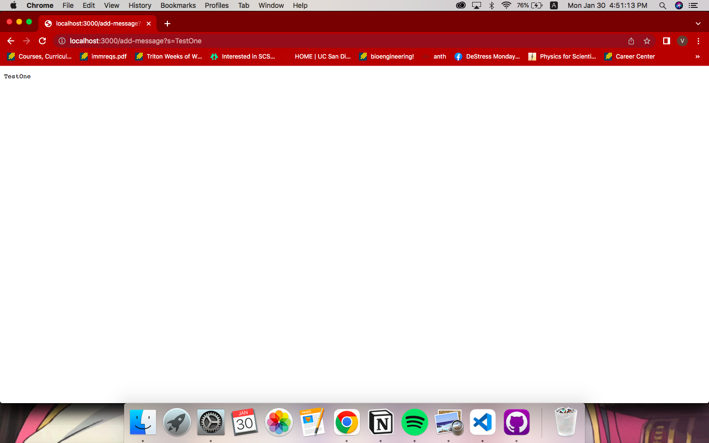
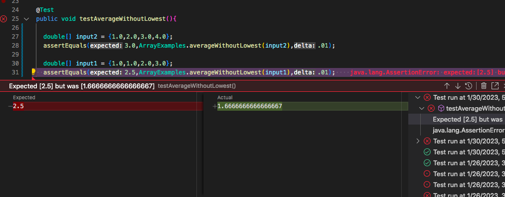

# Lab Report 2

**Documentation for creating a local server and the process of identifying and successfully debugging a piece of code.**

## Part 1: String Server

**The code:**
```
import java.io.IOException;
import java.net.URI;

class Handler implements URLHandler {
    String list = "";

    public String handleRequest(URI url) {
        if (url.getPath().equals("/")) {
            return list;
        } else {
            System.out.println("Path: " + url.getPath());
            if (url.getPath().contains("/add-message")) {
                String[] parameters = url.getQuery().split("=");
                if (parameters[0].equals("s")) {
                    list += parameters[1] + "\n";
                    return list;
                }
            }
            return "404 Not Found!";
        }
    }
}

class StringServer {
    public static void main(String[] args) throws IOException {
        if(args.length == 0){
            System.out.println("Missing port number! Try any number between 1024 to 49151");
            return;
        }

        int port = Integer.parseInt(args[0]);

        Server.start(port, new Handler());
    }
}
```

**Using /add-message:**


After the local server has been created, (in this the port is 3000), the link first displays an empty page. After adding /add-message?s=TestOne to the URL, the page now reads TestOne, as the **handleRequest** method is called. Specifically the else statement is called, where the text after the equals sign is added to the String list.

The relevant arguments are that the URL path contains /add-message. Then the text after the ? is split by the = sign, and read only if the query reads s= and there is some text after.

The values of the String list is changed, as the string TestOne is added to it along with a new line.


The same exact thing that happened previously takes place here. Except now the value of the String list changes again, to add the String "TestAgain" and a new line, so that the next /add-message will be added to a new line.

## Part 2: Debugging

The selected method to debug is `averageWithoutLowest`

**A failure-inducing input:**
```
double[] input1 = {1.0,1.0,2.0,3.0};
assertEquals(2.5, ArrayExamples.averageWithoutLowest(input1),0.01);
```

**An input that doesn't induce a failure:**
```
double[] input2 = {1.0,2.0,3.0,4.0};
assertEquals(3.0,ArrayExamples.averageWithoutLowest(input2),0.01);
```

**The symptom:**

The failure-inducing input is tested second to show that the other input passes successfully.


As shown in the screenshot above, although the expected average is 2.5, i.e 5/2, as the the lowest numbers should be ignored, the actual average is 1.667 i.e 5/3. There is clearly a problem with the number of values the sum is being divided with when there are multiple instances of the lowest number.

**The bug:**

Before:
```
  static double averageWithoutLowest(double[] arr) {
    if(arr.length < 2) { return 0.0; }
    double lowest = arr[0];
    for(double num: arr) {
      if(num < lowest) { lowest = num; }
    }
    double sum = 0;
    for(double num: arr) {
      if(num != lowest) { 
        sum += num;
      }
    }
    return sum / (arr.length-1);
  }
```
In the above code, it is clear that the bug lies with the number `sum` is being divided by. Even if the multiple lowest numbers are ignored by the `for` loop, the total sum is still divided by only 1 number less than the total amount of numbers in the array.

After:
```
  static double averageWithoutLowest(double[] arr) {
    if(arr.length < 2) { return 0.0; }
    double lowest = arr[0];
    for(double num: arr) {
      if(num < lowest) { lowest = num; }
    }
    double sum = 0;
    int index = 0;
    for(double num: arr) {
      if(num != lowest) { 
        sum += num;
        index++;
      }
    }
    return sum / (index);
  }
```
This solution creates a new `int` variable called index. Now whenever a number that is **not** the lowest number is added to the sum, the index is incremented by 1. So the final sum is divided by the corrext number to result in the correct `averageWithoutLowest` in the case of multiple lowest numbers.

## Part 3: What I Have Learnt
I learnt how to set up a web server and how to write basic code so that changes to the URL are reflected on the actual page. I learnt about the parts of an URL, i.e the path and the query, and how use my knowledge in Java to  potentially create more complex servers or websites.
