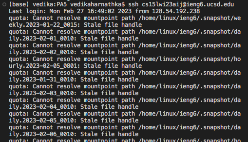
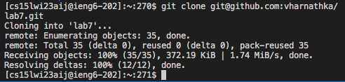
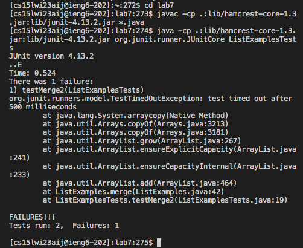
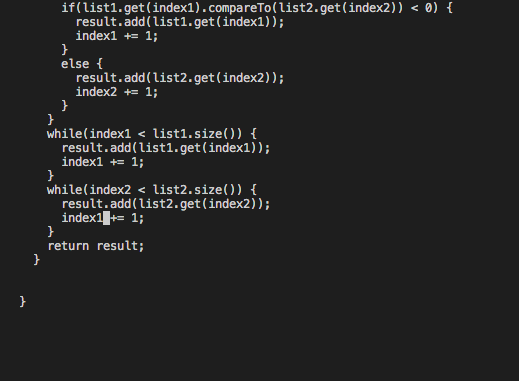
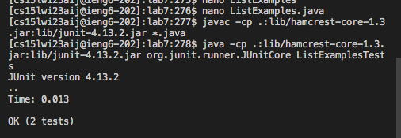
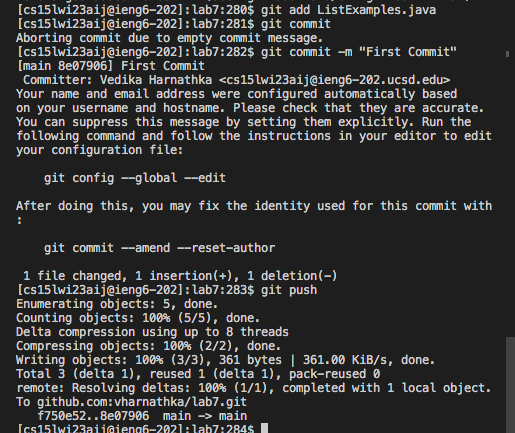

# Lab Report 4

Completing the tasks on terminal in the most efficient way possible:

### 1. Log into your ieng6 account:

`<up> <up> <enter>`

The log in was up 2 in the terminal so I accessed it using the up arrows.

### 2. Clone your fork of the repository from your github account

`git clone <Ctrl-V> <enter>`

I pasted the ssh clone link.

### 3. Run the tests demonstrating that they fail

`cd lab7`
`<up><up><up><up><up><enter>`

`<up><up><up><up><up><enter>`
  
first I changed directories to the lab7 directory.
  
the `javac -cp .:lib/hamcrest-core-1.3.jar:lib/junit-4.13.2.jar *.java` was up 5 in the search history and the `java -cp .:lib/hamcrest-core-1.3.jar:lib/junit-4.13.2.jar org.junit.runner.JUnitCore ListExamplesTests` was up 5 in the search history so I used the arrow keys to access them.

### 4. Edit the code to fix the failing test

`nano ListExamples.java`

`<Ctrl-W> <Ctrl-V> <up> <up> <up> <up> <up> <up> <up> <right> <right> <right> <right> <right> <right> <right> <backspace> 2`

The first two commands move the cursor to the bottom of the file, so that I am closer to the code I have to change. I then move up and then change `index1` to `index2` in the final while loop.

`<Ctrl-X> Y <enter>`
  
This exits and saves the file

  
### 5. Run the tests again
`<up><up><up><up><enter>`

`<up><up><up><up><enter>`
  
the `javac -cp .:lib/hamcrest-core-1.3.jar:lib/junit-4.13.2.jar *.java` was up 4 in the search history and the `java -cp .:lib/hamcrest-core-1.3.jar:lib/junit-4.13.2.jar org.junit.runner.JUnitCore ListExamplesTests` was up 4 in the search history so I used the arrow keys to access them.

### 6. Commit and push the resulting change to your Github account

`git add`
`git commit -m "First Commit"`
`git push`

