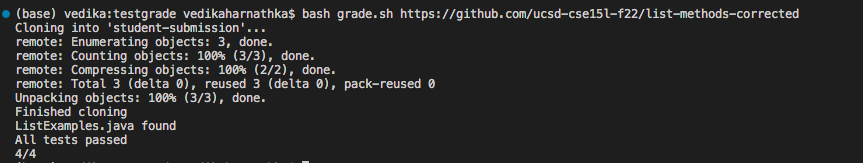

# Lab Report 5

The lab activity being picked is creating the grading script from lab 6. This activity was slightly confusing for me, so for this lab report I will go into detail about each step taken to complete and successfully run the grading script.

### Starter Code:
```
CPATH='.:lib/hamcrest-core-1.3.jar:lib/junit-4.13.2.jar'

rm -rf student submission
git clone $1 student-submission
echo 'Finished cloning
```
This sets CPATH to the JUnit path. `rm -rf` deletes any previous directories called student-submission and then `git clone` clones the input repository to the directory student-submission.

### Step 1: Check if the correct file has been submitted
```
if [[ -f student-submission/ListExamples.java ]]
then
  echo 'ListExamples.java found'
else
  echo 'ListExamples.java not found'
fi
```
This checks if the file `ListExamples.java` has been found. The `-f <val>` is true if the path *val* exists and is a file.

### Step 2: Get the student code and your test `.java` file into the same directory
```
cp student-submission/ListExamples.java ./
```

This uses the `cp` command to copy the required `ListExamples.java` file to the current directory


### Step 3: Compile tests and the student's code from the appropriate directory with the appropriate classpath commands.

```
javac -cp $CPATH *.java
```

`javac` compiles the `.java` files using the `CPATH` classpath. 

### Step 4: Run the tests and report the grade based on the JUnit output
```
java -cp $CPATH org.junit.runner.JUnitCore TestListExamples > junit-output.txt
```
This runs the JUnit test suite using the `CPATH` classpath. The output is redirected to a file called `junit-output.txt`.

```
FAILURES=`grep -c FAILURES!!! junit-output.txt`

if [[ $FAILURES -eq 0 ]]
then
  echo 'All tests passed'
  echo '4/4'
else
  RESULT=`grep "Tests run:" junit-output.txt`
  COUNT=${RESULT:25:1}

  echo "JUnit output was:"
  cat junit-output.txt
  echo ""
  echo "--------------"
  echo "| Score: $COUNT/4 |"
  echo "--------------"
  echo ""
fi
```

`grep -c` is used to count the number of lines that contain the string `FAILURES!!!`. If there are no failures then there will be 0 lines found, which is what the condition in the `if` statement is. `else`, The variables `RESULT` and `COUNT` finds the number of tests that passed so that it can give the score output. 

### Step 5: Test the grader:

```
$ bash grade.sh https://github.com/ucsd-cse15l-f22/list-methods-corrected
```

The grader was tested using this repository which is expected to get full or near-to-full credit. 



Thus `grade.sh` is successful!
